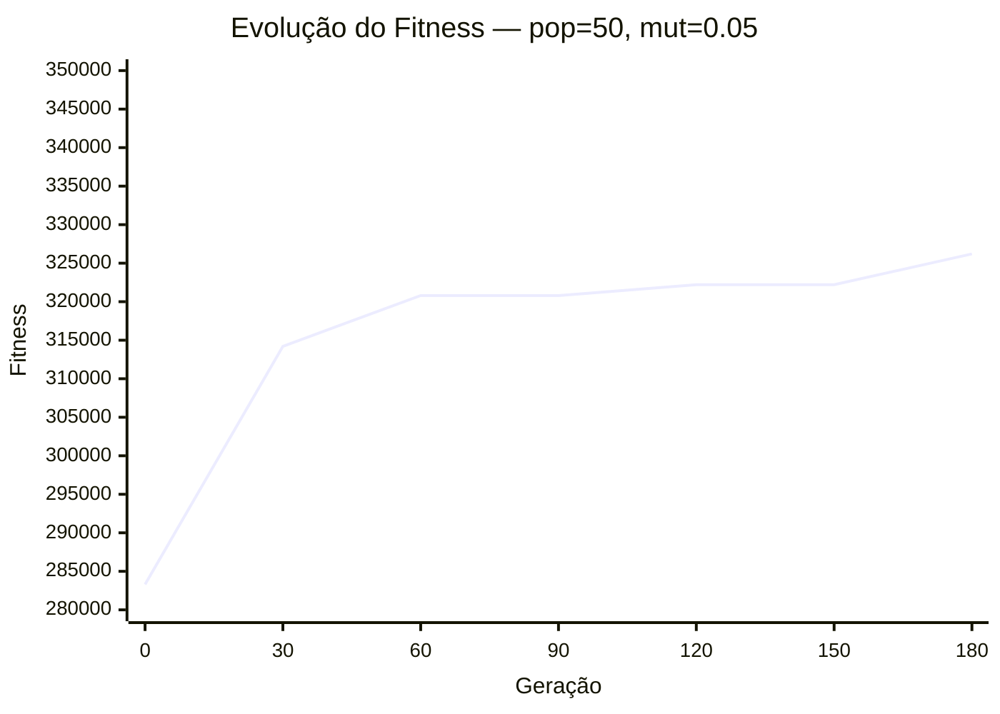
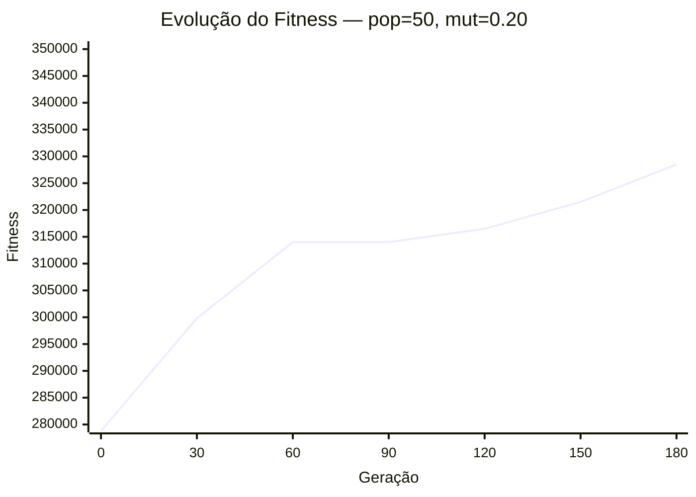
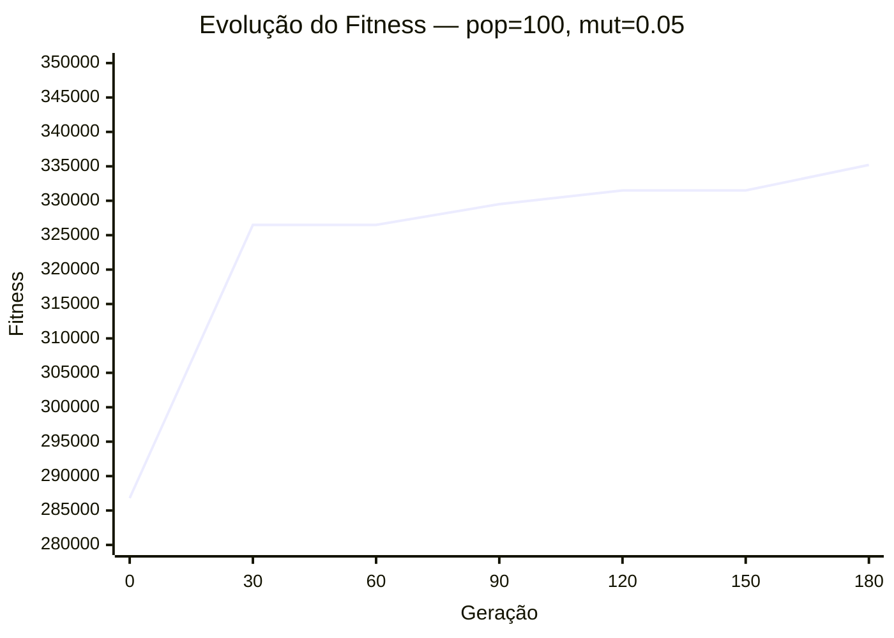
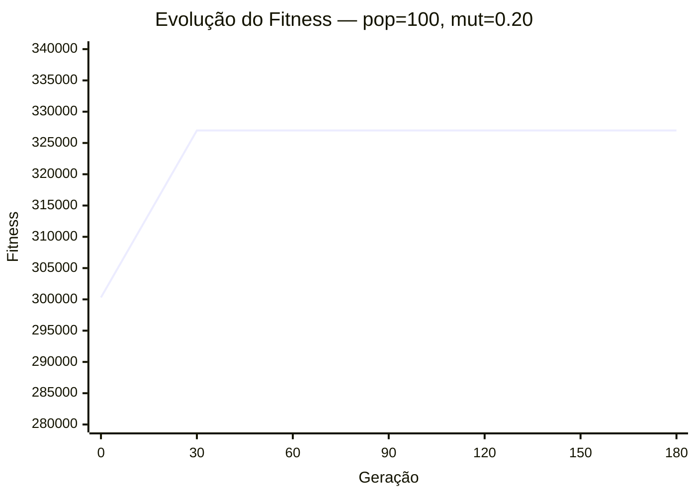

| População | Mutação | Melhor Fitness | Geração de Convergência | Violações |
|----------|--------|---------------|------------------------|----------|
| 50       | 0.05   | 326200        | 160                    | 11        |
| 50       | 0.20   | 328500        | 160                    | 0        |
| 100      | 0.05   | 335200        | 160                    | 4        |
| 100      | 0.20   | 327000        | 20                    | 0        |

**Conclusões**
- Por conta da nossa reparação, taxas de mutação baixas (0.05) produziram soluções com muitos erros.
- Mutação alta (0.20) diminuiu o fitness final em troca de 0 violações.
- População maior (100) convergiu mais rápido e com maior estabilidade.
- O algoritmo depende de uma taxa de mutação maior, mas consegue resolver o problema com estabilidade com os parâmetros corretos.
